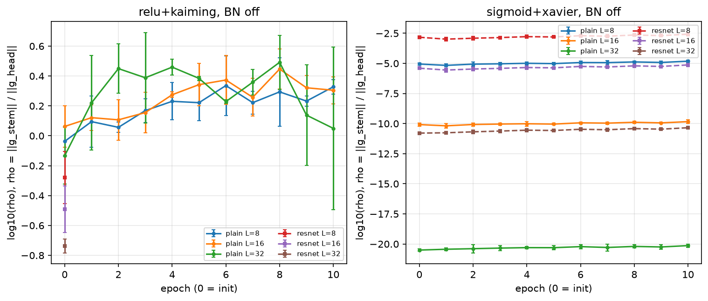

# Nghiên cứu Thực nghiệm: Động lực học Gradient trong Mạng Nơ-ron Sâu (PlainNet vs. ResNet)

**Tác giả:** Hồ Văn Lực, Phùng Đức Tuấn Kiệt — AIO2026, Module 4

Báo cáo LaTeX 32 trang (tiếng Việt) về *vanishing / exploding gradient*: từ tích Jacobian và chặn
$c = \sigma_{\max}(W)\cdot\max\sigma'$, qua minh hoạ số học và BPTT, đến hai thí nghiệm PyTorch có thể
tái lập:

- **Phase 1** (`experiment.py` → `results.md`): chuẩn gradient theo tầng **tại bước khởi tạo**,
  sigmoid + Xavier vs ReLU + He, $L \in \{5, 10, 20\}$, 5 seed.
- **Phase 2** (`experiment_training_dynamics.py` → `results_training.*`): động lực học gradient
  **trong 10 epoch huấn luyện**, PlainNet vs ResNet trên CIFAR-10 — 72 lần chạy.

## Thiết lập Phase 2

MLP rộng 256 trên 10.000 ảnh CIFAR-10 (tập con cố định), đánh giá trên 10.000 ảnh test.
Lưới: 2 kiến trúc × $L \in \{8, 16, 32\}$ × 4 biến thể {Sigmoid + Xavier, Sigmoid + Xavier + BN,
ReLU + Kaiming, ReLU + Kaiming + BN} × 3 seed {42, 100, 2024} = **72 runs**. SGD lr = 0.1, không
momentum, batch 128, 10 epoch, float32 CPU, `torch.use_deterministic_algorithms(True)`.

ResNet dùng activation **sau phép cộng**: $x_{l+1} = \phi(x_l + F(x_l))$,
$F$ = Linear → Norm → $\phi$ → Linear → Norm. Mỗi epoch đo trên một probe batch cố định 512 ảnh:

$$\rho = \frac{\lVert \partial\mathcal{L}/\partial W_{\text{stem}} \rVert_F}{\lVert \partial\mathcal{L}/\partial W_{\text{head}} \rVert_F},
\qquad \text{stem gnorm} = \lVert \partial\mathcal{L}/\partial W_{\text{stem}} \rVert_F .$$

## Ba kết quả chính

Mọi số liệu: trung bình ± độ lệch chuẩn mẫu trên 3 seed, đọc từ `results_training.json`.

1. **ReLU ResNet không BatchNorm phân kỳ ở 9/9 lần chạy, ngay trong epoch 1** — mạng càng sâu càng
   sớm (bước 3–4 ở $L=8$, bước 2 ở $L=16$, bước 1 ở $L=32$). Identity path cộng dồn phương sai qua
   từng khối: tại khởi tạo stem gnorm ở $L=32$ đã là $(2.32 \pm 0.244)\times10^{3}$ và mất mát trên
   probe batch là $1480$ (so với $\ln 10 \approx 2.30$ của bộ phân loại ngẫu nhiên).
2. **Sigmoid ResNet với activation sau phép cộng vẫn suy giảm theo hàm mũ**: ở $L=32$,
   $\log_{10}\rho = -10.8$ (ResNet) so với $-20.5$ (PlainNet). Jacobian của một khối là
   $\mathrm{diag}(\sigma')(I + \partial F/\partial x)$ — thừa số $\sigma' \le 1/4$ nằm *ngoài* identity
   path. Tỉ số $\log\rho_{\text{ResNet}}/\log\rho_{\text{Plain}}$ = 0.560 / 0.536 / 0.526 ở
   $L$ = 8 / 16 / 32 khớp với tỉ số số thừa số $\sigma'$ trên đường ngắn nhất, 5/9 / 9/17 / 17/33.
   Residual connection chia đôi số mũ, không xoá nó; cả 18 lần chạy sigmoid không BN đều ở 10.0% test acc.
3. **ResNet + BatchNorm ổn định huấn luyện ở $L=32$**: test acc **32.0 ± 5.77%** so với
   **22.9 ± 1.09%** của PlainNet; mọi seed ResNet (27.5–38.5%) đều vượt mọi seed PlainNet (22.2–24.2%).
   Lợi thế chỉ xuất hiện ở độ sâu lớn — ở $L=8$ PlainNet + BN nhỉnh hơn (35.1 vs 31.6%).

### So sánh ở $L = 32$, ReLU + Kaiming, epoch 10

| Biến thể | Kiến trúc | Test acc (%) | $\log_{10}\rho$ | Stem gnorm |
|---|---|---|---|---|
| ReLU + BN | PlainNet | 22.9 ± 1.09 | −1.26 ± 0.145 | 0.0469 ± 0.0076 |
| ReLU + BN | ResNet | **32.0 ± 5.77** | −0.342 ± 0.156 | 1.07 ± 0.221 |
| ReLU, không BN | PlainNet | 16.1 ± 6.82 ¹ | 0.0497 ± 0.545 ¹ | 5.41 ± 3.08 ¹ |
| ReLU, không BN | ResNet | phân kỳ (3/3) | — | — |

¹ Trung bình trên 2 seed: seed 42 phân kỳ ở epoch 1, bước 3. Toàn lưới có 10/72 lần chạy phân kỳ,
tất cả đều là ReLU không BN.

## Hình

**Chuẩn gradient theo tầng qua 10 epoch** ($L=32$, Sigmoid + Xavier, không BN; trái PlainNet, phải
ResNet). ResNet kéo stem từ ~$10^{-20.5}$ lên ~$10^{-10.8}$ nhưng gradient vẫn giảm theo hàm mũ từ head
về stem, và không epoch nào thay đổi được điều đó.

![Heatmap log10 ||g^[l]||_F, PlainNet vs ResNet](figures/heatmap_plain_vs_resnet.png)

**$\log_{10}\rho$ theo epoch, không BN** (trái ReLU + Kaiming, phải Sigmoid + Xavier; đường liền
PlainNet, đường đứt ResNet). Với sigmoid, mọi đường gần như nằm ngang; với ReLU, ResNet chỉ có điểm
epoch 0 vì mọi lần chạy đều phân kỳ ở epoch 1.



## Tái lập

### Thí nghiệm

Môi trường gốc: Python 3.12.3, PyTorch 2.14.0+cpu, CPU 6 luồng.

```bash
pip install torch torchvision numpy matplotlib

python experiment.py                              # Phase 1 -> results.md
python experiment_training_dynamics.py --sanity   # chỉ chạy self-check
python experiment_training_dynamics.py            # Phase 2 -> results_training.{json,md},
                                                  # figures/*.png, training_dynamics.log (~17 phút CPU)
```

Phase 2 tự tải CIFAR-10 về `~/.cache/cifar10` (đổi bằng `--data-dir`). Với cùng phần cứng và phiên
bản thư viện, chạy lại cho cùng kết quả (cùng seed hai lần được kiểm tra bằng `assert` trong script).

### Báo cáo LaTeX

Cần một bản TeX Live đầy đủ (pdfLaTeX, `vntex`, `biblatex`, `tcolorbox`, `pgfplots`, `fontawesome5`).
Biên dịch **từ thư mục gốc của repo**:

```bash
pdflatex -interaction=nonstopmode main.tex
bibtex main
pdflatex -interaction=nonstopmode main.tex
pdflatex -interaction=nonstopmode main.tex   # -> main.pdf, 32 trang
```

## Cấu trúc repo

```
.
├── main.tex                         # master: preamble + \input{sections/*}
├── sections/
│   ├── 01-tongquan.tex              # I.   Tổng quan
│   ├── 02-cosotoan.tex              # II.  Cơ sở toán học của lan truyền ngược
│   ├── 03-nguyennhan.tex            # III. Hai nguyên nhân cốt lõi, chặn c
│   ├── 04-vidu.tex                  # IV.  Minh hoạ số học ba tầng (MSE vs BCE)
│   ├── 05-bptt.tex                  # V.   Lan truyền ngược theo thời gian
│   ├── 06-thucnghiem.tex            # VI.  Thực nghiệm (Phase 1 + VI.4 Phase 2)
│   └── 07-tongket.tex               # VII. Tổng kết và nguyên lý khắc phục
├── references.bib
├── vipythonhighlight.sty            # style highlight Python (tiếng Việt)
├── tvietlistings.sty                # tiếng Việt trong listings
├── Figures/aio2026_logo.pdf         # logo trang bìa
├── figures/                         # hình Phase 2 (sinh bởi script)
├── experiment.py                    # Phase 1
├── results.md
├── experiment_training_dynamics.py  # Phase 2
├── results_training.json            # nguồn sự thật: mọi số liệu theo từng run/epoch
├── results_training.md              # bảng tổng hợp
└── training_dynamics.log            # stdout đầy đủ của lần chạy Phase 2
```
